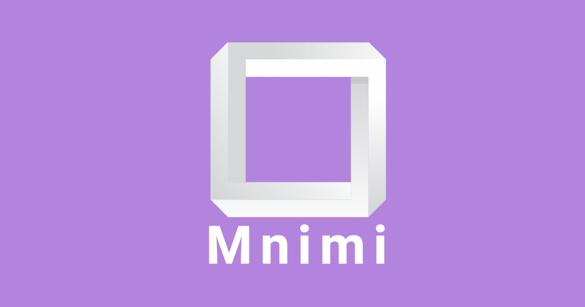

# Mnimi

# Overview

Mnimi is a study deck web app designed to help users build and use their own decks to 
study and learn content. Users will have the ability to create decks of flashcards
and use them to improve their studying process.

# Links
- [Figma File](https://www.figma.com/file/h2TqlIKCjfBfFQgyknxZFc/Official-Pod-3-Design---Prototype?node-id=213%3A1142)

# Features

## Deck Creation
Users will have the ability to build decks of flash cards, with cards able to contain
both text and/or images. Users can create as many decks as they want, and can also use
existing ones that other users created.

## Efficient Study
Mnimi is build based on the principle of Space repetition, which describes how our 
brains learn more effectively when we space out our learning over time.

Users open a deck and are able to see a card with the question or diagram on the front.
They can click the card to flip it and show the answer, then select how confident they
were in their answer:
1. blue = Confident/knew it, 
2. green = know it, but want to see it again
3. red = did not know

Our Decks are designed to react to the user feedback on how well they knew the content,
which will allow users to optimize their learning based on the principles of spaced 
repetition. 

## Login and Account Creation
Users login using email and password credentials to allow them to save decks, study master,
and progress between sessions.

# Acknowledgements

Many thanks to the following members of the development team:

1. Tony Kechichian
2. Nora Chamseddin
3. Siddharth Khanna
4. Duncan Spizzirri

Also, thank you to Jevin Sidhu, who was the project advisor from LCS for this project.

# Remaining To-Dos:
- [ ] Forgot password functionality
- [ ] Add keyboard event listener to escape key to close modals
- [ ] Mobile optimization polish
- [ ] Create “Recently Studied” component
- [ ] Implement search functionality
- [ ] Address the background z-index issues on the deck page
- [ ] Generate a new SECRET_KEY and load from .env
- [ ] Card on the deck page requires additional styling
